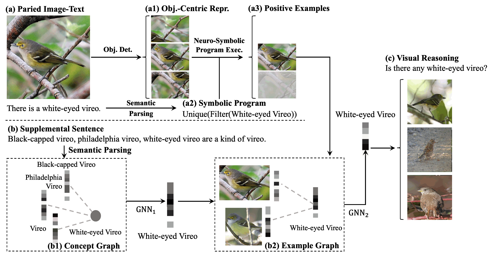
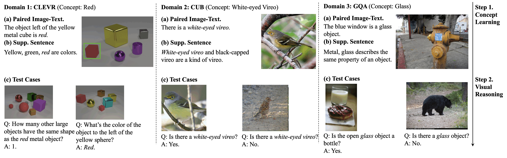

# FOCAL-Pytorch
 Fast Object Centric Concept and Activity Learner. Reproduce several papers related.
 This repo is aimed to reproduce several papers related to the concept learner.

PyTorch implementation of FALCON: Fast Visual Concept Learning by Integrating Images, Linguistic descriptions, and Conceptual Relations
ICLR 2022

[Paper](https://openreview.net/pdf?id=htWIlvDcY8) [Website](https://people.csail.mit.edu/jerrymei/projects/falcon/) 

This repo aimed to build a model that learns quick.